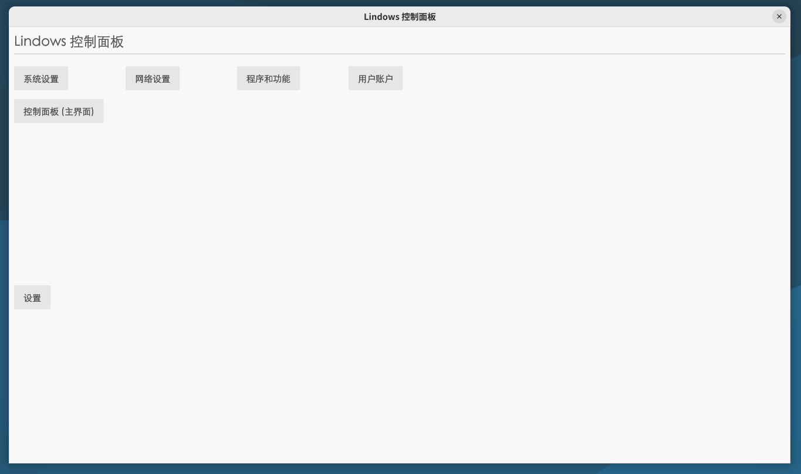
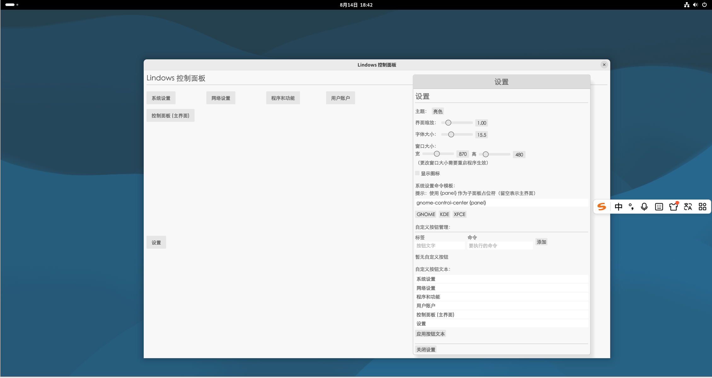
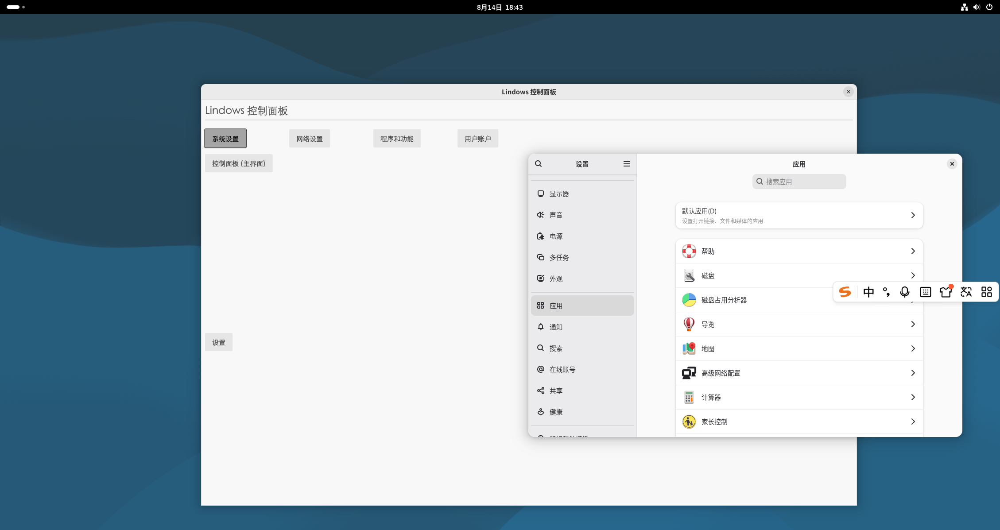

# Lindows 控制面板

> 我修复了Linux不能使用控制面板的Bug?

Windows Control（中文：Windows 控制面板），是Windows系统中一个传统的核心管理工具，用于集中查看和更改系统设置。

之后，Microsoft在Windows 8中添加了“设置”应用，但是这并不能完全取代控制面板

然而Linux只有系统设置，并不能使用到控制面板，于是我在Linux中添加了控制面板

所以，这是一个基于 [egui](https://github.com/emilk/egui) 的轻量级 Linux 系统设置快速启动工具。它提供了一键打开常见系统设置面板（如网络、用户、程序等）的能力，并支持自定义命令按钮，适合对 GNOME、KDE、XFCE 等桌面环境进行快速配置。

---

## 功能特性

- **自动跳转系统设置**  
  支持 GNOME Control Center、KDE System Settings、XFCE Settings Manager 等主流桌面环境。
- **自定义命令按钮**  
  在界面中添加任意命令按钮，方便快速启动常用工具或脚本。
- **可视化配置**  
  通过 GUI 设置窗口调整主题（深色/浅色）、界面缩放、字体大小、窗口尺寸，以及是否显示图标。
- **按钮文本自定义**  
  自由修改每个内置按钮的显示文字，满足不同语言或个性化需求。
- **配置持久化**  
  所有设置自动保存为 `config.json`，下次启动自动加载。
- **中文字体支持**  
  内置 `STXIHEI.TTF` 字体，确保中文显示美观。

---

## 截图







---

## 编译与运行

### 前置要求

- Rust 工具链（建议使用 stable 版本）
- Linux 桌面环境（GNOME / KDE / XFCE 等）

### 获取源码

```bash
git clone https://github.com/BobbyChengCN0518/Lindows_Control.gi
cd lindows-control-panel
```

---

## 其他

这个程序主要由DeepSeek Flash编写，我负责修复一些Bug，另外，这里使用了先进又安全的Rust语言编写，在Windows on Linux里还是比较少见的

---

## 许可证

MIT
